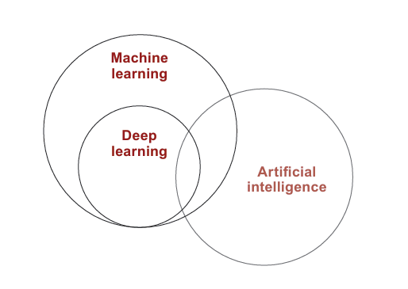
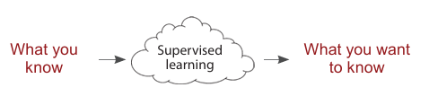
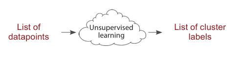
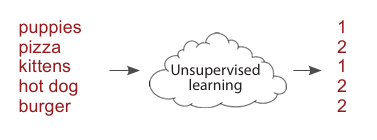
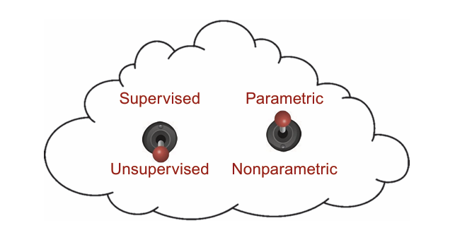
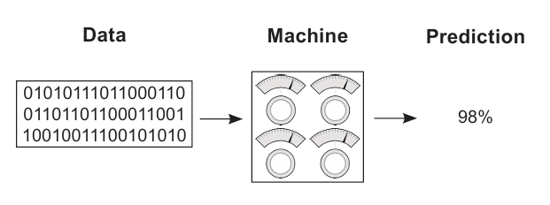
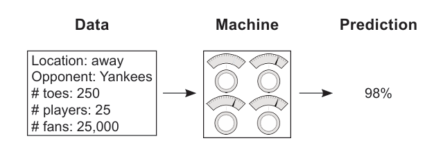
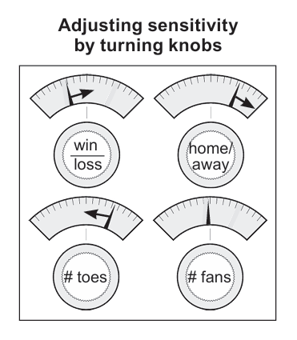

# CHAPTER 2: foundamental concepts: How do Machine Learn

In this chapter

- What _deep learning_, _machine learning_, and _artificial intelligence_?.
- What are _parametric models_ and _nonparametric models_ ?
- What are _Supervised_ & _Unsupervised_ learning?
- How can machines learn?

> Machine learning will cause every successful IPO win in five years.  > _~ Eric Schmidt, Google executive chairman, keynote speech, Cloud Computing Platform conference, 2016_

## What is deep learning?

### Deep learning is a subset of methods for machine learning.

- Deep learning is a subset of machine learning, which is a field dedicated to the study and development of machines that can learn (sometimes with the goal of eventually attaining general artificial intelligence, AGI).

- In industry, deep learning is used to solve practical tasks in a variety of fields such as **computer vision (image)**, **natural language processing (text)**, and **automatic speech recognition (audio)**.

fig1:

- Notice in this figure that not all of deep learning is focused around pursuing generalized
  artificial intelligence (sentient machines as in the movies).

- Many applications of this
  technology are used to solve a wide variety of problems in industry

## What is machine learning?

> A field of study that gives computers the ability to learn without being explicitly programmed.  _~ Attributed to Arthur Samuel_

- Machine learning is a subfield of computer science wherein _machines learn_ to perform tasks for which they were not _explicitly programmed_.

## Supervised machine learning

### Supervised learning transforms datasets.

- Supervised learning is a method for transforming one dataset into another.

- For example, if you had a dataset called Monday Stock Prices that recorded the price of every stock on every Monday for the past 10 years, and a second dataset called Tuesday Stock Prices recorded over the same time period, a supervised learning algorithm might try to use one to predict the other.

fig2:

- If you successfully trained the supervised machine learning algorithm on 10 years of Mondays and Tuesdays, then you could predict the stock price on any Tuesday in the future given the stock price on the immediately preceding Monday.

- Supervised machine learning is the bread and butter of applied artificial intelligence (also known as **narrow AI**).

- It’s useful for taking what you know as input and quickly transforming it into what you want to know. This allows supervised machine learning algorithms to extend human intelligence and capabilities in a seemingly endless number of ways.

fig3:

## Unsupervised machine learning

### Unsupervised learning groups your data

- Unsupervised learning shares a property in common with supervised learning: it transforms one dataset into another. But the dataset that it transforms into is not _previously known or understood_.

- Unlike supervised learning, there is no “right answer” that you’re trying to get the model to duplicate. You just tell an unsupervised algorithm to “find patterns in this data and tell me about them.”

- For example, _clustering a dataset into groups_ is a type of unsupervised learning.

- Clustering transforms a sequence of datapoints into a sequence of cluster labels. If it learns 10 clusters, it’s common for these labels to be the numbers 1–10. Each datapoint will be assigned to a number based on which cluster it’s in. Thus, the dataset turns from a bunch of datapoints into a bunch of labels.

- Why are the labels numbers? The algorithm doesn’t tell you what the clusters are. How could it know? It just says, “Hey scientist! I found some structure. It looks like there are groups in your data. Here they are!”

fig4:

- This idea of clustering is something you can reliably hold onto in your mind as the definition of unsupervised learning. Even though there are many forms of unsupervised learning, all forms of unsupervised learning can be viewed as a form of clustering.

- Check out the example below. Even though the algorithm didn’t tell what the clusters are named,
  can you figure out how it clustered the words? (Answer: 1 == cute and 2 == delicious.)

fig5:

=======================================================================================

#### STICKY NOTES 📝

- **Clustering in Unsupervised Learning**

  - Clustering is a method in **unsupervised learning** that groups datapoints based on their similarities.
  - It transforms raw datapoints into **cluster labels**, representing structured groups.

- **Why Are Labels Numbers?**

  - The algorithm assigns numerical labels (e.g., **1–10** for 10 clusters) because it **does not** inherently understand what the clusters represent.
  - It only detects patterns and structure, leaving the **interpretation** of clusters to scientists or analysts.

- **The Role of the Scientist**
  - The algorithm says: _"Hey scientist! I found groups in your data. Here they are!"_
  - It does not explain what the clusters **mean**, only that distinct groupings exist.
  - The scientist must analyze the clusters to determine if they represent real-world categories (e.g., customer types, genetic sequences, or product preferences).

=======================================================================================

## Parametric vs. nonparametric learning

### Oversimplified: Trial-and-error learning vs. counting and probability

fig6: 

- As you can see, there are really four different types of algorithms to choose from.

- An algorithm is either **unsupervised** or **supervised**, and either **parametric** or **nonparametric**.

- Whereas the previous section on supervision is about the _type of pattern_ being learned,
  parametricism is about the way the learning is _stored_ and often, by extension, the
  _method for learning_.

- Formal definitions of parametricism versus nonparametricism. _For the record, there’s still some debate around the exact difference._

  > A parametric model is characterized by having a _fixed_ number of parameters, whereas a nonparametric model’s number of parameters is _infinite_ (determined by data).

- As an example, let’s say the problem is to fit a square peg into the correct (square)
  hole. Some humans (such as babies) just jam it into all the holes until it fits somewhere
  (parametric). A teenager, however, may count the number of sides (four) and then search
  for the hole with an equal number (nonparametric). Parametric models tend to use trial and
  error, whereas nonparametric models tend to count

=======================================================================================

#### STICKY NOTES 📝

- **Parametric Models (Trial and Error)**
  - These models make **assumptions** about the data and often have a fixed number of parameters.
  - The analogy here compares parametric learning to a **baby** trying to fit a square peg into a hole:
    - The baby tries different holes randomly, jamming the peg until it fits—similar to how parametric models generalize patterns based on fixed parameters.  
      fig7: fitting a square peg into the correct (square) hole
      
- **Nonparametric Models (Counting & Searching)**
  - Nonparametric models make **fewer assumptions** and can grow their parameters depending on the complexity of the data.
  - The analogy compares nonparametric learning to a **teenager** counting the number of sides on the peg:
    - The teenager **checks** the peg has four sides and **searches** for a hole with the same number—similar to how nonparametric models analyze relationships in data rather than relying on predefined assumptions.  
      fig8: counting the number of pegs
      
- **Key Difference**
  - Parametric models rely on **trial and error** with a fixed method.
  - Nonparametric models are **more flexible**, adapting their approach based on observed data (like counting sides in the analogy).

=======================================================================================

## Supervised parametric learning

### Oversimplified: Trial-and-error learning using knobs

- Supervised parametric learning machines are machines with a fixed number of knobs (that’s
  the parametric part), wherein learning occurs by turning the knobs.

- Input data comes in, is processed based on the angle of the knobs, and is transformed into a prediction.

fig9:

- Learning is accomplished by turning the knobs to different angles.

- If you’re trying to predict the probability that the Red Sox _(the Boston Red Sox are an American professional baseball team based in Boston.)_ will win the World Series, then this model would first take data (such as sports stats like win/loss record or average number of toes per player) and make a prediction (such as 98% chance). Next, the model would observe whether or not the Red Sox actually won. After it knew whether they won, the learning algorithm would _update_ the knobs to make a more accurate prediction the next time it sees the _same or similar input data_.

- Perhaps it would “turn up” the “win/loss record” knob if the team’s win/loss record was a
  good predictor. Inversely, it might “turn down” the “average number of toes” knob if that
  datapoint wasn’t a good predictor. This is how parametric models learn!

> Note that the entirety of what the model has learned can be captured in the positions of the knobs at any given time. You can also think of this type of learning model as a search algorithm. You’re “searching” for the appropriate knob configuration by trying configurations, adjusting them, and retrying.

> Note further that the notion of trial and error isn’t the formal definition, but it’s a common (with exceptions) property to parametric models. When there is an arbitrary (but fixed) number of knobs to turn, some level of searching is required to find the optimal configuration. This is in contrast to nonparametric learning, which is often count based and (more or less) adds new knobs when it finds something new to count.

### Let’s break down supervised parametric learning into its three steps.

#### Step 1: Predict

- To illustrate supervised parametric learning, let’s continue with the sports analogy of trying to predict whether the Red Rox will win the World Series.

- The first step, as mentioned, is to gather sports statistics, send them through the machine, and make a prediction about the probability that the Red Sox will win.

#### Step 2: Compare to the truth pattern

- The second step is to compare the prediction (98%) with the pattern you care about (whether the Red Sox won). Sadly, they lost, so the comparison is

$$\text{Pred: } 98\% \quad > \quad \text{Truth: } 0\%$$

- This step recognizes that if the model had predicted 0%, it would have perfectly predicted the upcoming loss of the team. You want the machine to be accurate, which leads to step 3.

#### Step 3: Learn the pattern

- This step adjusts the knobs by studying both how _much_ the model missed by (98%) and what the input data was (sports stats) at the time of prediction. This step then turns
  the knobs to make a more accurate prediction given the input data.

- In theory, the next time this step saw the same sports stats, the prediction would be lower than 98%. Note that each knob represents the _prediction’s sensitivity to different types of input data_. That’s what you’re changing when you “learn.”

